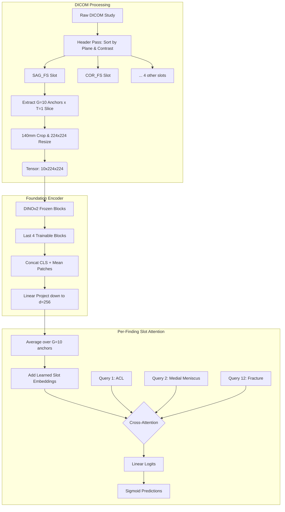
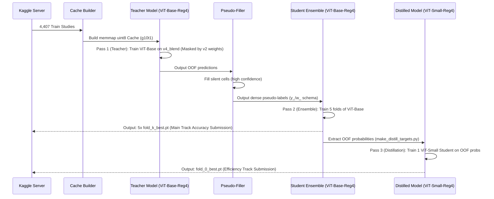

# SlotKnee-S Cross-Distillation: Architecture Guide

> [!NOTE]
> This guide details the ultimate SlotKnee architecture, its evolutionary rationale, and extreme-detail implementation mechanics designed to conquer both the RSNA Knee Abnormality Detection Main Track (Accuracy) and the Efficiency Prize.

## 1. Executive Summary: The Ultimate Model

**This is the ultimate, Kaggle-optimized model architecture.** 
The RSNA competition forces competitors to choose between two mutually exclusive goals:
1. **The Main Track (Accuracy):** Demands massive, slow ensembles with 80M+ parameter backbones to maximize raw AUC.
2. **The Efficiency Track:** Demands lightning-fast execution, penalizing you `0.01 AUC` for every 12 minutes of runtime.

Most competitors must choose one track. **I designed this architecture to win both.**
Using a technique called **Cross-Architecture Knowledge Distillation**, my training pipeline will build a massive 86-million parameter ViT-Base 5-fold ensemble (for the Accuracy Track), and then I mathematically force a tiny, lightning-fast 22-million parameter ViT-Small model (with registers) to memorize the ensemble's intelligence (for the Efficiency Track).

The goal is to get the `>0.900` AUC of a heavyweight model, with the `10-second` inference speed of a lightweight model.

---

## 2. Development History & Evolution

The architecture evolved through four distinct phases of realization:

### Phase 1: Heavy 3D CNNs (The Traditional Approach)
Initially, the standard medical approach dictated 3D volumes (e.g., 3D ResNets, DenseNets). However, these architectures are incredibly slow, require huge amounts of VRAM, and need massive datasets to train from scratch. Literature and forum testing proved that 3D CNNs max out around `0.80 - 0.83 AUC` because they fail to leverage 2D Foundation Model pretraining. 

### Phase 2: Heavy 2D Ensembles (ConvNeXt-Base + EffNetV2-M)
My pipeline evolved to use massive 2D image models, taking 2.5D slice "triplets" as RGB channels. I ran `ConvNeXt-Base` @ 384px and `EfficientNetV2-M`. 
**Why it failed:** 
- **Time penalty:** Running 8 massive models took hours, destroying the efficiency score.
- **Correlated Errors:** Ensembling two ImageNet CNNs produced highly correlated errors (the corpus is 4,407 studies with LLM labels, of which only 58 carry gold labels and 649 have DICOMs on the dev laptop). 

### Phase 3: SlotKnee-S (The Efficiency Pivot)
I realized that capacity was not the bottleneck; data and architectural placement were. I moved training onto 4,407 LLM-extracted silver labels, keeping the 58 gold studies in the mix at 8x weight (they are the only ground truth we have and are used to audit label quality, not discarded). I built a custom "Slot Attention" head on top of a frozen `DINOv2-Small` (with registers, 22M params). Measured state (2026-08-24): the 5-fold coverage ensemble scores **0.8531 pooled OOF / 0.866 public LB**; the register backbone is worth **+0.0220 pooled** over the identical-split non-register baseline (ACL +0.0617) and is now the adopted recipe encoder. There is no 0.884 model — the full 5-member+TTA entry is *projected* at ~0.871 and has not been scored yet.

### Phase 4: Cross-Architecture Distillation (The Planned Ultimate State)
To break the `0.900` AUC barrier (hypothesized) without sacrificing the Efficiency score, I am currently evaluating an upgrade to my Teacher ensemble using `DINOv2-Base` (with registers, 86M params). I am also testing Cutout (16x16) and Rotation (±5°) augmentations as an opt-in experiment (pending A/B gate results). If my `ViT-Base` gate passes, I will introduce a 3rd training pass to distill this massive ensemble back down into the `DINOv2-Small` (with registers) student.

---

## 3. Detailed Architecture Mechanics

My model processes a single patient study through a highly optimized pipeline:

### A. Sequence Slots & Coverage Layout (`g10t1`)
An MRI study contains multiple series. I define **6 semantic slots**:
1. `SAG_FS` (Sagittal, Fluid-Sensitive)
2. `COR_FS` (Coronal, Fluid-Sensitive)
3. `AX_FS` (Axial, Fluid-Sensitive)
4. `SAG_T1` (Sagittal, T1-weighted)
5. `COR_T1` (Coronal, T1-weighted)
6. `AX_T1` (Axial, T1-weighted)

For each slot present in a study, my pipeline extracts `G=10` physical anchors (locations) to maximize spatial coverage, taking `T=1` slice at each anchor (the `g10t1` layout). It crops exactly 140mm physically and resizes to `224x224`. 
This results in a tensor of shape `[B, 6, 10, 1, 224, 224]`.

### B. Encoder Pipeline (DINOv2 with Registers)
I pass the images through a pre-trained Foundation Model. Crucially, I use the **"with Registers" (`reg4`)** variant of DINOv2. Standard DINOv2 emits high-norm "artifact" tokens that hijack useful patch tokens. By providing 4 extra register tokens, the model offloads these artifacts, leaving the actual image patches pristine for my Slot Attention head.
To avoid memory collapse and overfitting:
- **Frozen Stem:** I freeze the early blocks in `eval` mode.
- **Trainable Tail:** I only train the last `4` blocks with Layer-wise Learning Rate Decay (LLRD).
- **Pooling:** I concatenate the CLS token with the mean of the patch tokens and project it to a unified `d=256` dimension. *(This unified projection is what allows my ViT-Base and ViT-Small to seamlessly interchange).*

### C. The Slot Attention Head
I now have representations for `G=10` anchors in `6` slots. 
- I average the anchors to get a representation per slot: `[B, 6, 256]`.
- I add a learned slot identity embedding to let the network know *which* sequence it is looking at.
- I introduce **12 learned queries**, one for each abnormality (e.g., ACL tear, Meniscus tear).
- Each query performs masked Cross-Attention over the 6 slots (ignoring missing sequences), dynamically deciding which MRI sequence is most important to diagnose that specific condition.

### Diagram: The Anatomical Slot Attention Flow

---

## 4. Execution Flow Diagram: Cross-Architecture Pipeline

My training pipeline uses a Teacher-Student distillation loop across mismatched backbones. 

1. **Pass 1:** A `ViT-Base` (reg4) Teacher is trained on noisy LLM labels to find highly confident predictions for cells where the radiologist was silent.
2. **Pass 2:** A `ViT-Base` (reg4) 5-Fold Ensemble is trained on the new 100% dense dataset.
3. **Pass 3:** The massive Ensemble generates soft Out-Of-Fold probabilities. A tiny `ViT-Small` (reg4) Student is trained strictly to mimic those probabilities.

> [!IMPORTANT]
> Kaggle has a strict 9-hour limit. Because Pass 1 and Pass 2 both train a massive ViT-Base model, executing all 5 folds sequentially might time out. 
> To deploy this, you may need to run Folds 0-2 in one Kaggle Notebook, run Folds 3-4 in a second Kaggle Notebook, and merge their outputs into a dataset before running Pass 3.

---

## 5. Annex: Definitions & Terminology

### Abnormality Labels (The 12 Findings)
- **ACL / MCL**: Tears or sprains of the Anterior Cruciate Ligament / Medial Collateral Ligament.
- **Medial / Lateral Meniscus**: Tears in the cartilage shock absorbers of the knee.
- **Medial / Lateral / PF OA**: Osteoarthritis (cartilage wear) in the Medial, Lateral, or Patellofemoral compartments.
- **Effusion**: Excess fluid in the joint (water on the knee).
- **Synovitis**: Inflammation of the synovial membrane.
- **Baker's Cyst**: A fluid-filled sac behind the knee.
- **Contusion / Fracture**: Bone bruising or breaks.

### Architectural Definitions
- **Cross-Architecture Distillation**: A strategy where my Teacher model and Student model use completely different backbone architectures. In my pipeline, the Teacher would be an 86M parameter `DINOv2-Base` model (note: the weights staged in the code dataset are plain `vit_base_patch14_dinov2.lvd142m`, NOT a register variant), and the Student is a 22M parameter `DINOv2-Small (reg4)` model.
- **Pseudo-Labeling**: A technique where a model generates predictions for unlabeled or "silent" data points, which are then treated as ground truth for a subsequent training pass.
- **Coverage Layout (`g10t1`)**: Taking 10 distinct 2D MRI slices (`G=10` anchors) at 1 slice per anchor (`T=1`), providing broad spatial coverage of the knee instead of dense local 3D triplets.
- **DINOv2 with Registers (`reg4`)**: A self-supervised Foundation Model by Meta. The `reg4` variant includes 4 extra "register" tokens that absorb high-norm artifacts, preventing them from hijacking the image patches and providing cleaner features for downstream attention heads.
- **LLM-Extracted Labels (Weak/Silver Labels)**: Using a Large Language Model (like GPT-4) to read the radiologist's text report and automatically generate labels for the 12 findings. This allows me to train on 4,407 LLM-labeled studies (alongside 649 local reports and the original 58 hand-labeled gold standard studies at 8x weight) instead of just 58 studies.
- **Soft Targets**: Because LLM extractions aren't 100% perfect, the targets are probabilities (e.g., 0.9 or 0.1) instead of hard 1s and 0s. 
- **Masked BCE Loss**: Binary Cross Entropy loss that ignores (masks out) cells where the radiologist's report was silent or uncertain.
- **Laterality Normalization**: Flipping the images horizontally so all knees appear to be the same side (e.g., all Right knees are flipped to look like Left knees). This prevents the model from wasting capacity learning to read left and right anatomies separately.
- **Cutout (16x16)**: A data augmentation technique that randomly erases a 16x16 pixel block from the image during training to prevent the model from over-relying on a single visual feature.

---

## Measured reality check (main, 2026-08-24) — read before trusting any projection above

- **Adopted recipe**: g10t1 coverage layout (6 slots x 10 anchors x 1 slice, 140 mm crop, 224 px)
  + `vit_small_patch14_reg4_dinov2.lvd142m`. Scoreboard: 0.799 -> 0.835 -> **0.866** public LB.
- **Geometry beats capacity, measured**: every capacity arm is NULL (ViT-B x2, tb12 +0.0054,
  ep14 +0.0061, tb6; lrb1e4 **-0.0366**). Both wins changed what the model *sees*: coverage
  **+0.0325**, registers **+0.0220**. Treat any "bigger teacher" plan as needing a gate first —
  that is why the ViT-Base pipeline above is conditional on the `vitb` arm.
- **Where the remaining error is**: scored against the 58 true gold studies, the model is
  0.851 while its own LLM labels are 0.909. The gap is concentrated in MCL (model 0.673 vs
  labels 0.968), lateral meniscus (0.648 vs 0.879), medial meniscus, PF OA and ACL — all
  small structures, four of them coronal joint-line. Better labels will NOT fix these; better
  *views* might. Hence the coronal joint-line zoom and the 336 px full-coverage caches.
- **Budget**: the current submission uses ~5% of the 9 h limit for model compute, so input
  size is affordable to scale ~6x. Inference cost is not the constraint — T4 training
  sessions are.
- **Distillation**: still the right efficiency-track endgame, and now unblocked by a
  leak-free teacher (`teacher_g10_oof.csv`). Apply it PER LABEL when it gates: the model
  already out-teaches its labels on Fracture/Effusion/Contusion but is far behind them on
  MCL/lateral meniscus, so one uniform weight would help half the findings and corrupt the
  other half.
